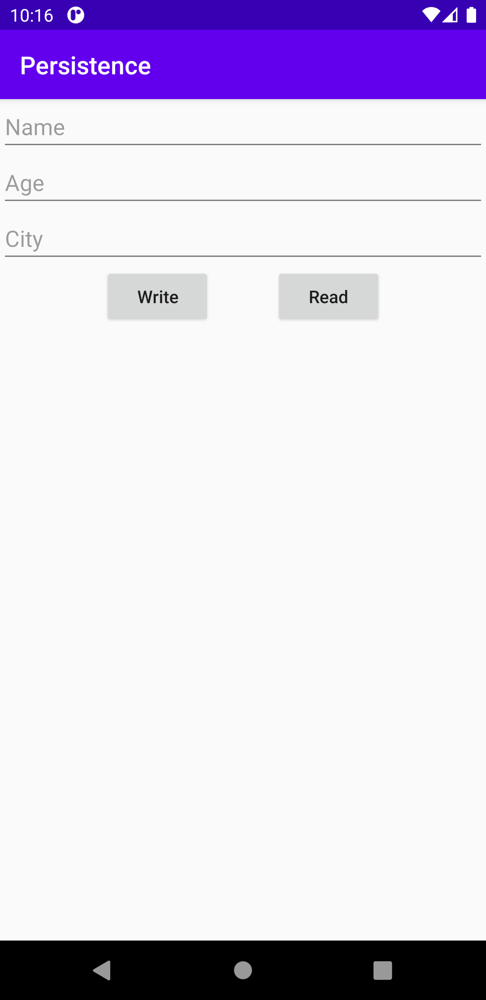
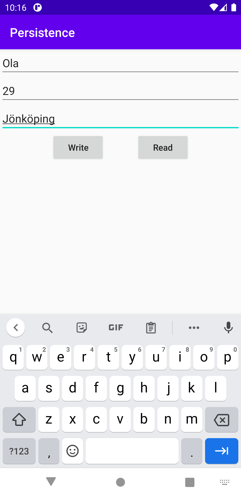
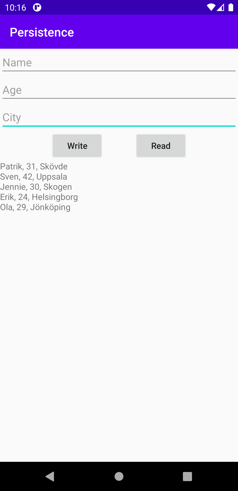

# Assignment 7 Persistence

Vi börjar med att skapa två nya java klasser där vi skapar våran databas tabell i den ena och våran
databas hjälpare i den andra. Med hjälp av dem två klasserna kan vi skapa en databas där vi väljer
vad vi ska spara samt i vilket format det ska sparas. Som vi kan se i koden nedan så bestämmer vi i våran
databas tabell att vi ska lagra name, age och city. Vi väljer att name ska vara en sträng samt att det
ska vara vår primary key vilket i detta fall gör att vi endast kan lagra personer med olika namn. Det
är alltså ingen lämplig primary key då flera kan ha samma namn och bör vara något som är unikt som exempelvis
ett personnummer. Sedan väljer vi att lagra age som int vilket gör att den tar emot heltal. Sist sparar
vi city också som en sträng.

```
People.COLUMN_NAME_NAME + " STRING PRIMARY KEY," +
People.COLUMN_NAME_AGE + " INT," +
People.COLUMN_NAME_CITY + " STRING)";
```

På våran startsida som vi kan se i Figur 1 har vi lagt in tre edittext som vi kan använda oss utav för
att skriva in data som ska sparas. Under dem har vi två knappar där ena knappen lägger in datan som skrivits
in i databasen och den andra knappen läser upp datan som finns i databasen. Datan som läses ifrån databasen
visas sedan i en textview som finns under de två knapparna.


*Figur 1. Startsida med edittext och buttons*

När ett namn, ålder och stad har skrivits in i de tre edittext rutorna så körs koden nedan när knappen
Write trycks på, detta går att se i Figur 2 nedan. Då tar den texten som står i den första textrutan och
lägger in databasen som namn. Sedan tar den texten i andra textrutan och lägger in som ålder samt texten
i den tredje textrutan och lägger in som stad. Sedan avslutas koden med att datan retureneras in i databsen
som skapats tidigare.

```
private long addPeople() {
    ContentValues values = new ContentValues();
    values.put(DatabaseTable.People.COLUMN_NAME_NAME, String.valueOf(textName.getText()));
    values.put(DatabaseTable.People.COLUMN_NAME_AGE, String.valueOf(textAge.getText()));
    values.put(DatabaseTable.People.COLUMN_NAME_CITY, String.valueOf(textCity.getText()));
    return database.insert(DatabaseTable.People.TABLE_NAME, null, values);
}
```


*Figur 2. Lägga till personer i databasen*

När den andra knappen används som säger Read, så hämtas datan ifrån databasen som sedans skrivs ut i
en textview. En fukntion körs för att hämta namn, ålder och stad och så länge som det finns mer information
så fortsätter koden att hämta datan. När det inte finns mer lagrat i databasen så slutar koden och returnerar
då all information.

```
while (cursor.moveToNext()) {
    People people = new People(
        cursor.getString(cursor.getColumnIndexOrThrow(DatabaseTable.People.COLUMN_NAME_NAME)),
        cursor.getInt(cursor.getColumnIndexOrThrow(DatabaseTable.People.COLUMN_NAME_AGE)),
        cursor.getString(cursor.getColumnIndexOrThrow(DatabaseTable.People.COLUMN_NAME_CITY))
    );
    peoples.add(people);
}
```

Efter att informationen har hämtats så skapas en temporär tabell där all information finns och en iteration
utförs. Koden går då igenom hela tabellen för att skriva ut namn, ålder och stad i textviewn. Koden körs
så länge det finns information som ej skrivits ut och för varje ny person som skrivs ut så skapas det
en ny rad. I Figur 3 nedan kan vi se hur det ser ut när informationen ifrån en databas skrivs ut i appen.

```
List<People> tmp = getPeople();
for (int i = 0; i < tmp.size(); i++) {
    People p = tmp.get(i);
    Log.d("MainActivityRead ==>",p.getName() + ", " + p.getAge() + ", " + p.getCity());
    textView.append(p.getName() + ", " + p.getAge() + ", " + p.getCity() + "\n");
}
```


*Figur 3. Läsa från databasen*